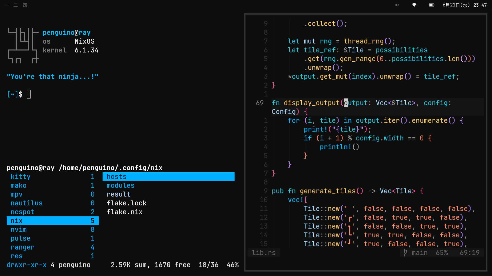

# massivebird's dotfiles



[`nixOS`](https://nixos.org/) is really cool and you should check it out 🐧

## programs

+ [`kitty`](https://sw.kovidgoyal.net/kitty/) terminal
+ [`neovim`](https://github.com/neovim/neovim) text editor
+ [`ranger`](https://github.com/ranger/ranger) file browser
+ [`rofi`](https://github.com/davatorium/rofi) app launcher
+ [`sway`](https://github.com/swaywm/sway) window manager
+ [`waybar`](https://github.com/Alexays/Waybar) status bar
+ [`fish`](https://github.com/fish-shell/fish-shell) shell
+ [`zathura`](https://pwmt.org/projects/zathura/) pdf viewer

## installation

This repo is intended to be cloned into/as the system's `~/.config` directory.

I usually do something gross like this:

```cmd
cd ~
git clone https://github.com/massivebird/dotfiles
mv .config/* .config/.* dotfiles
rm -rf .config
mv dotfiles .config
```

### loading the nixOS flake

The `nix` directory contains my configuration flake for nixOS.

After following the above instructions, run:

```cmd
sudo nixos-rebuild switch --flake ~/.config/nix#<hostName>
```

## misc

[previous wallpaper](https://unsplash.com/photos/VWEFQ7q9GFw)
