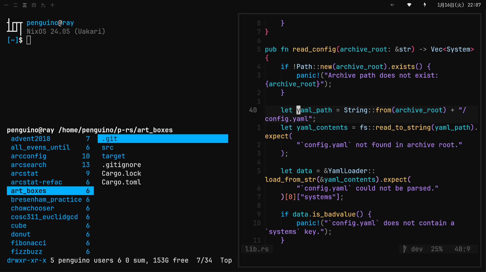

# massivebird's dotfiles


<br>


## What I use

[`nixOS`](https://nixos.org/) is really cool and you should check it out 🐧

+ [`fish`](https://github.com/fish-shell/fish-shell) shell
+ [`kitty`](https://sw.kovidgoyal.net/kitty/) terminal
+ [`neovim`](https://github.com/neovim/neovim) text editor
+ [`ranger`](https://github.com/ranger/ranger) file browser
+ [`rofi`](https://github.com/davatorium/rofi) app launcher
+ [`sway`](https://github.com/swaywm/sway) window manager
+ [`waybar`](https://github.com/Alexays/Waybar) status bar
+ [`zathura`](https://pwmt.org/projects/zathura/) pdf viewer

## Installation

This repo is intended to be cloned into/as the system's `~/.config` directory.

I usually do something gross like this:

```bash
cd ~
rm -rf .config
git clone https://github.com/massivebird/dotfiles .config
```

### Loading the nixOS flake

The `nix` directory contains my NixOS system config flake.

After running the above commands, run:

```bash
sudo nixos-rebuild switch --flake ~/.config/nix#<hostname>
```

## Miscellaneous

[previous wallpaper](https://unsplash.com/photos/VWEFQ7q9GFw)
